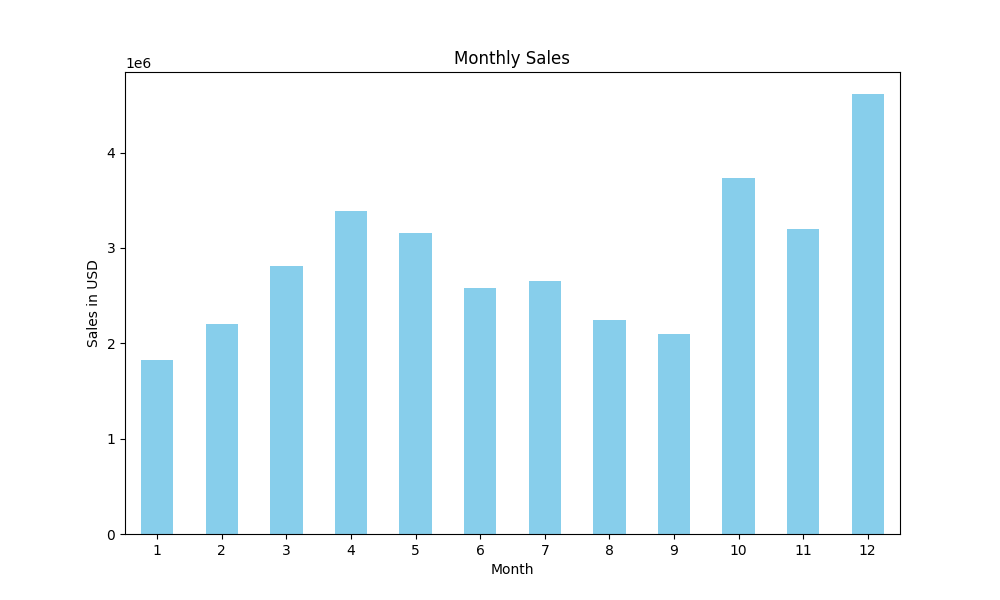
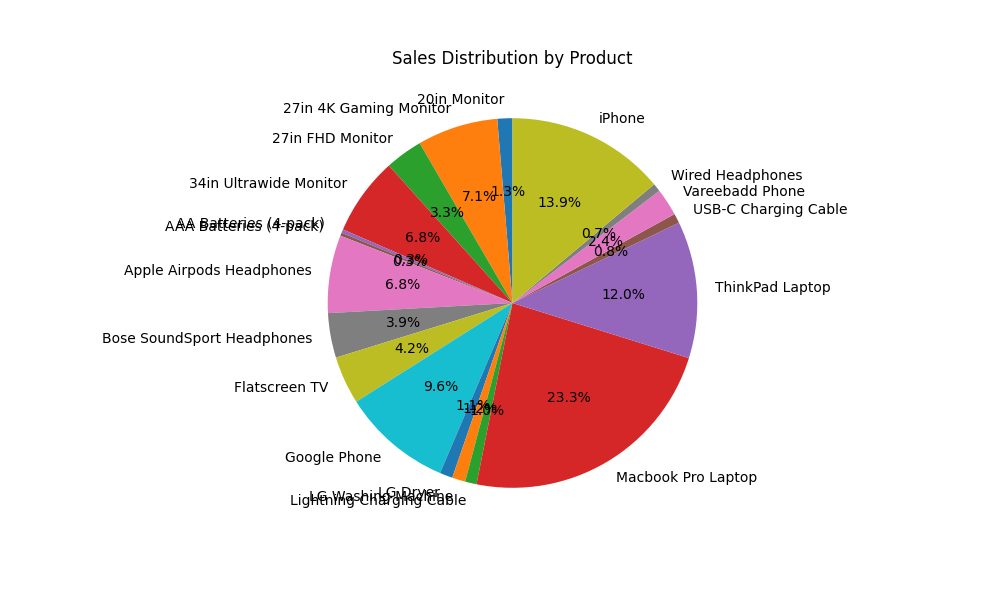

# Sales Data Analysis

## Overview
This project analyzes sales data to visualize monthly sales performance.

## Dataset
The dataset used in this project contains sales information including Order ID, Product, Quantity Ordered, Price Each, Order Date, and Purchase Address.

## Analysis
- Total sales calculated for each month.
- Monthly sales visualized in a bar chart.

## How to Run
1. Install the necessary Python libraries: `pandas`, `matplotlib`.
2. Update the file name in `sales_analysis.py` with your dataset's name.
3. Run the script using the command: `python sales_analysis.py`.

## Findings
- Insights on sales trends can be observed through the generated charts.
# Sales Data Analysis Project

## Monthly Sales Bar Chart

## Product Sales Pie Chart

